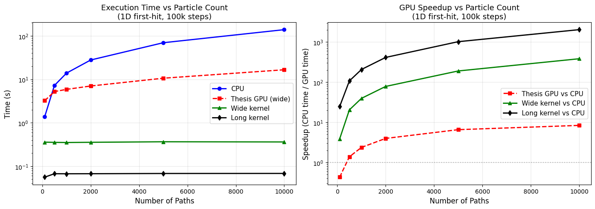
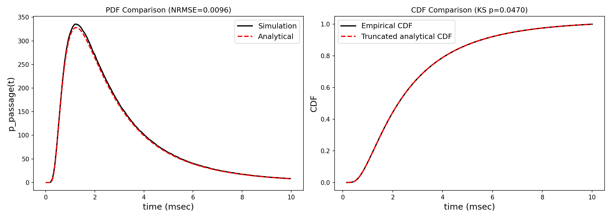
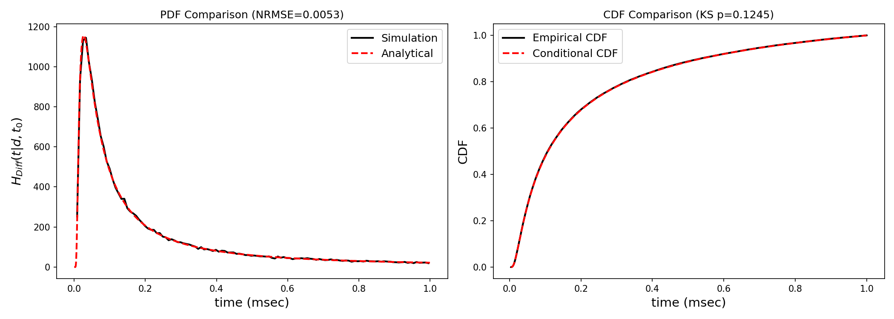

# Molecular Communication GPU Simulator

GPU-accelerated Monte Carlo simulation of molecular communication in blood vessels.
Simulates particle diffusion via Brownian motion with optional laminar drift,
modeling how nanoscale messenger molecules move through the bloodstream.

Based on the master's thesis *"The Application of GPU to Molecular Communication
Studies"* (Cain, Eastern Washington University, 2018, advised by Dr. Uri Rogers
and Dr. Yun Tian).

## Performance

The original thesis GPU implementation (GTX 1070) topped out at 200k particles
in ~6 minutes, with the GPU actually slower than the CPU beyond 100k paths due
to per-timestep memory transfers.

After optimization, the same simulation runs **2,000x faster**:

| Particles | Thesis (GTX 1070) | Current (A100) | Speedup vs CPU |
|-----------|-------------------|----------------|----------------|
| 1,000     | 2.27s             | 0.067s         | 25x            |
| 10,000    | 4.81s             | 0.068s         | 2,037x         |
| 100,000   | 111.98s           | 0.12s          | 1,250x         |
| 5,000,000 | 5.08s             | 0.91s          | —              |
| 10,000,000| —                 | 14.4s          | —              |

The gold standard run — 10M particles at dt=1E-8 (10 trillion particle-steps) —
completes in **143 seconds** on an A100, validated against analytical solutions.



## Validation

All simulation output is validated against closed-form analytical solutions
using the Kolmogorov-Smirnov test (not visual inspection). This caught a
boundary-crossing bias at 10k+ paths that was invisible in histogram overlays,
leading to the Brownian bridge correction.





## Quick Start (Google Colab)

The easiest way to run the simulator is through Google Colab, which provides
free access to NVIDIA GPUs. No local GPU or CUDA installation required.

### 1. Create a GitHub Personal Access Token

The repo is private, so Colab needs a read-only token to clone it.
Use a fine-grained token scoped to just this repository.

1. Go to [github.com/settings/personal-access-tokens/new](https://github.com/settings/personal-access-tokens/new)
2. **Token name**: e.g. "colab-mc-sim"
3. **Expiration**: 90 days (or your preference)
4. **Resource owner**: your GitHub account
5. **Repository access**: select **Only select repositories**, then choose
   `molecular_modeling_gpu`
6. **Permissions**: under **Repository permissions**, set **Contents** to
   **Read-only**. Leave everything else at **No access**.
7. Click **Generate token**
8. **Copy the token** — you won't be able to see it again

This gives Colab the minimum access needed: read-only to this one repo.

### 2. Open the Colab Notebook

1. Go to [colab.research.google.com](https://colab.research.google.com)
   - Sign in with a Google account if you don't have one
2. Click **File > Open notebook**
3. Select the **GitHub** tab
4. Paste the repo URL: `https://github.com/alwaysEpic/molecular_modeling_gpu`
   - You may need to check "Include private repos" and authorize Colab
5. Select `scripts/colab_build_test.ipynb`

### 3. Add Your Token to Colab Secrets

1. In the left sidebar, click the **key icon** (Secrets)
2. Click **Add a new secret**
3. Name: `GITHUB_PAT`
4. Value: paste the token you copied in step 1
5. Toggle **Notebook access** on

### 4. Select a GPU Runtime

1. Go to **Runtime > Change runtime type**
2. Under **Hardware accelerator**, select **T4 GPU** (free tier) or **A100** (if available)
3. Click **Save**

### 5. Run the Notebook

Click **Runtime > Run all** or step through cells one at a time.

The notebook is organized as a progression:

| Section | What it does | A100 Time |
|---------|-------------|-----------|
| Setup | Builds the simulator | ~1 min |
| Particle Path | 3D random walk visualization | seconds |
| Validation | KS tests against analytical solutions (1D, 3D, walls) | ~10 sec |
| Consistency | CPU/GPU agreement, reproducibility, RNG quality | ~2 min |
| Performance | Thesis vs current speedup comparison with charts | ~5 min |
| Stress Tests | 1M and 10M path validation with plots | ~30 sec |
| Research Grade | Timestep convergence, distance/drift sweeps, gold standard CIR | ~5 min |

Total run time is about 15 minutes on an A100 (~45 min on T4, mostly the
gold standard CIR which takes ~20 min on T4 vs ~2.5 min on A100).

## Local Build (requires CUDA)

```bash
git clone https://github.com/alwaysEpic/molecular_modeling_gpu.git
cd molecular_modeling_gpu
mkdir build && cd build
cmake ..
make -j$(nproc)
```

This builds:
- `mc_sim` — GPU simulator (requires NVIDIA GPU + CUDA toolkit)
- `mc_sim_cpu` — CPU-only reference (always builds)

### Usage

```bash
# 10k particles, first-hit mode, verbose
./mc_sim -i 10000 -f -v

# 1D planar receiver with drift
./mc_sim -i 10000 -f -l 3E-7 -t 1E-2

# Force wide kernel (for development)
./mc_sim -i 10000 -f -l 3E-7 -t 1E-2 -W

# CPU-only
./mc_sim_cpu -i 10000 -f -l 3E-7 -t 1E-2
```

### Validation

```bash
# Run local pre-commit test suite (CPU-only, no GPU needed)
./scripts/validate_before_commit.sh
```

## GPU Kernel Architectures

**Wide kernel** (`d_update`): One kernel launch per timestep. All particles
advance together, positions in global memory. Required for future particle
interactions.

**Long kernel** (`d_simulate_isolated`): Single launch, each thread runs one
particle's full path with positions in registers. Much faster for independent
particles (first-hit mode).

## Key Parameters

| Parameter | Default | Description |
|-----------|---------|-------------|
| `-i N` | 1000 | Number of particle paths |
| `-t T` | 1E-3 | Simulation duration (seconds) |
| `-d DT` | 1E-7 | Time step (seconds) |
| `-f` | off | First-hit recording mode |
| `-l D` | off | 1D planar limit distance (meters) |
| `-n` | off | Disable drift |
| `-w` | off | Enable vessel walls |
| `-W` | off | Force wide kernel |
| `-S N` | 0 | RNG seed (0 = time-based) |
| `-v` | off | Verbose output |
| `-h` | — | Show all options |

## Project Structure

```
src/
  common/
    params.h              # SimParams struct
    cli.h                 # CLI parsing
  main.cu                 # GPU entry point
  main_cpu.cpp            # CPU-only entry point
  simulation_cpu.cpp/.h   # CPU reference implementation
  simulation_gpu.cu/.h    # GPU kernels (long + wide)
scripts/
  colab_build_test.ipynb  # Colab notebook (start here)
  validate_*.py           # Validation scripts
  validate_before_commit.sh
docs/
  thesis.pdf              # Original thesis
  brownian_bridge.md      # Bridge correction derivation
  domain_reference.md     # Physics and literature reference
  future_directions.md    # Research directions
```
